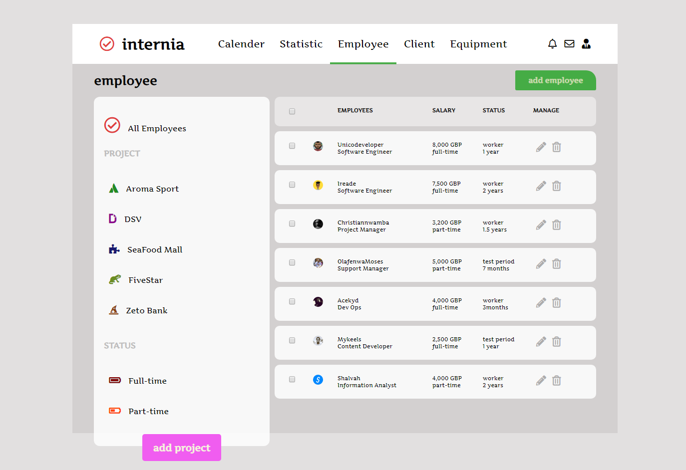

# Employee Management System Dashboard

Allows you to edit employees' data, and also delete the data. The employees list used in this project is fetched from Github's API

### Installation & Setup

  Clone this repository and install its dependencies.

        > git clone https://github.com/temmietope/employee-management-system

        > cd employee-management-system

        > npm install

        > npm start

  Application is live on port 3000

        http://localhost:3000

### Screenshots

### Repository

[https://github.com/temmietope/employee-management-system](https://github.com/temmietope/employee-management-system)